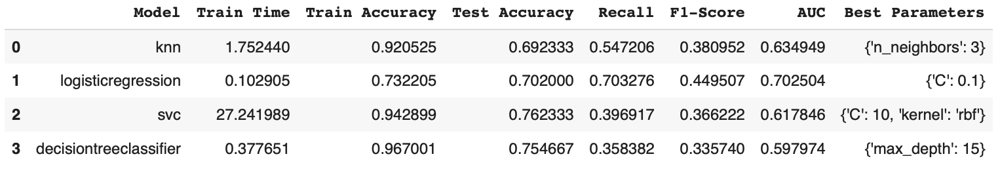
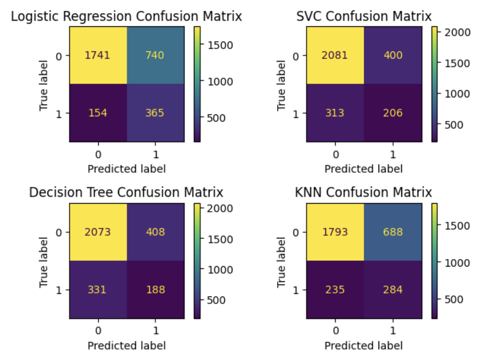
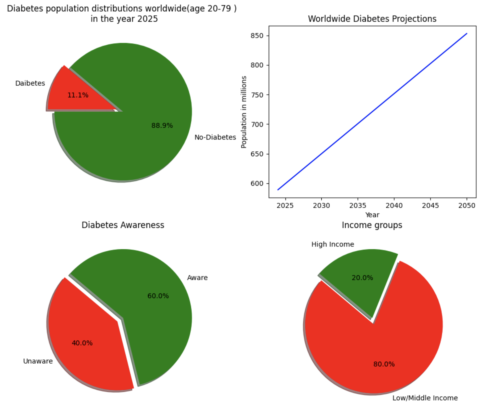
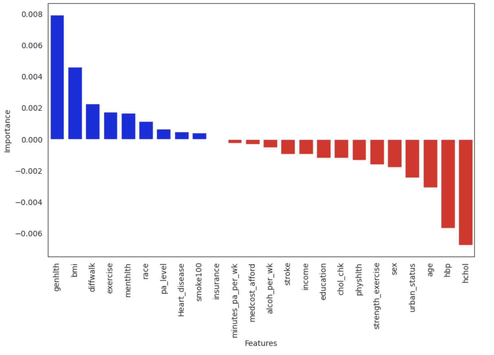

###  **Project Title: Diabetes Risk Indications**

**Author** Jitendra Prasad  
**Date** 05/17/2025  

### Executive summary
**Project overview and goals:** To enable early intervention and potential prevention of diabetes, the aim is to develop a machine learning model that accurately identifies individuals at high risk by analyzing their medical history, lifestyle factors, and other relevant data.

The ML model goal is to predict if an individual is at a risk of diabetes  or not.

**Findings:** Logistic regression with C= 0.1 regularization seems to be the WINNER here with 70% Test accuracy and best Recall, F1 and AUC scores. Also Confusion matrix has least False Negative which is important for medical risk. Missing a disease i.e higher false negative can have severe consequences.

* **Model results:**

* **Confusion Matrix:**

### Rationale
In this century, Diabetes is one of the silent killer lifestyle disease impacting millions of population worldwide. A diabetic person's blood sugar regulation system stops being effective resulting in high level of sugar in bloodstream. This high level of blood sugar over the time clinically associated with several life complications like, heart disease, obesity, high blood pressure, kidney failures etc.

According to the International Diabetes Federation (IDF) Diabetes Atlas 2025, 11.1% of the adult population (20-79 years) worldwide is living with diabetes. This means that approximately 1 in 9 adults in this age group has diabetes.

Here are some additional details refrenced from: https://idf.org/about-diabetes/diabetes-facts-figures/

Daibetes is incurable but early sign or detection of it can help manage the future risk with certain lifestyle changes like healthy eating, reducing weight, being active and with proper education about the diseaes and regular medical checkups.

Using Machin Learning predictive model, one can get an early indication of the disease and will be able to manage the risk effectively and well in time. As per CDC, many who are at great risk are unaware of it.

#### Research Question
1. What are the risk factors to an individuals getting diabetes?
2. Can ML model predict and early indication of the disease ?
3. Can ML recommend a life style change to manage the risk?

#### Data Sources
In the United States of America, Center for disease control (CDC) annually performs comprehensive health survay called Behavioral Risk Factor Surveillance System (BRFSS). This is a phone survey to collect data on chrnoic health conditions, lifestyle and risk behaviours over a large population acorss all states.

In this project, I am using BRFSS 2023 survey data from CDC : https://www.cdc.gov/brfss/annual_data/annual_2023.html

The data code book at : https://www.cdc.gov/brfss/annual_data/2023/zip/codebook23_llcp-v2-508.zip  

[data](data)

The CSV format of BRFSS 2023 Survey data is obtained from : https://www.kaggle.com/datasets/isuruprabath/brfss-2023-csv-dataset

The dataset originally has

*   **Total response ( samples):** 433323

*   **Total Features ( Columns):** 350

**Since github limits the size of file upload, the original data has been trimmed to 15% **

*  ** Reduced file :** BRFSS2023_R.csv

*   **Total response ( samples):** 64998

*   **Total Features ( Columns):** 350

#### Methodology
CRISP-DM Data Science lifecycle approach is applied. This process provides a framework for working through a data problem. 
The steps involved are following:

(1) Buisness understanding  
(2) Data understanding  
(3) Data preperation  
(4) Data modeling  
(5) Evaluation  
(6) Deployment 

In order to build an accurate predictive model, I plan to explore following techniques:
1. Data cleaning, preprocessing and feature engineering
2. Exploring supervised learning algorithms like Logistic regression, DecisionTreeClassifiers,   Support vector machines, KNN etc
3. Evaluating and picking up the best models for accuracy, precision, AUC-ROC etc

#### Results
The output of the model to predict the target value binary classification if an individual is high risk or diabetes or not. The model should also indicate which feature puts the individual at high risk of diabetes i.e the feature that correlates most with target class.

* **Permutation Importance**
* Positive Perumtation: Feature is important
* Negative Permutation: Feature is not important or weakly important

* **Important features that significantly relates to diabetes risk are:**
1. Genhlth -- General health of an individual
2. bmi -- Body mass index
3. diffwalk -- Having diffculty walking
4. exercise -- Physical activit or exercise
5. race -- Race
6. pa_activity -- What is the level of physical activity
7. Heart_desease -- Ever had coronary heart disease (CHD) or myocardial infarction (MI)
8. smoke100 -- Smoker

#### Next steps
The results will be applied, such as aiding healthcare providers in early diagnosis or tailoring interventions for high-risk individuals.

#### Outline of project

- [Link to notebook 1](diabetes_risk.ipynb)

